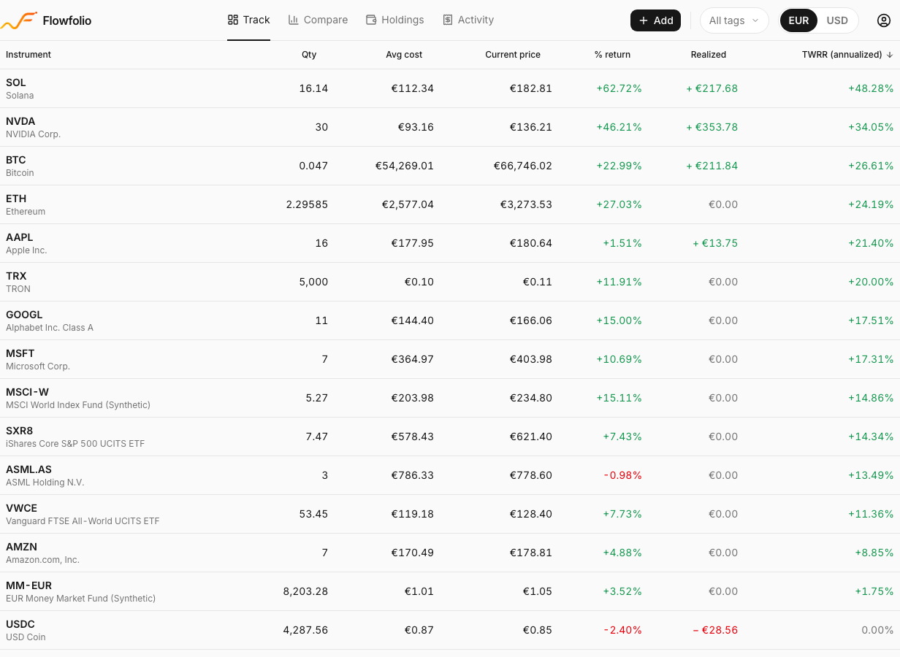
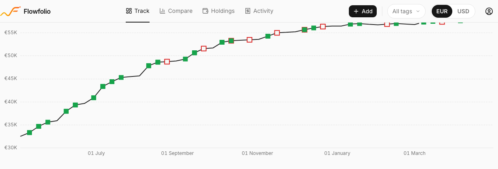
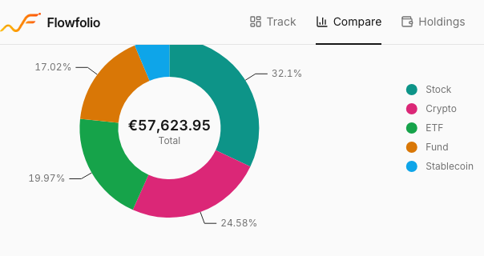

# Flowfolio

Flowfolio is a self-hosted personal portfolio tracker. It records your buy and sell transactions across stocks, ETFs, funds, crypto, and stablecoins held in multiple accounts, then shows you which holdings have actually performed best over time. Because it captures your full transaction history (not just snapshots), it can answer the question a spreadsheet never could: which investments are genuinely worth owning? It runs entirely on your own infrastructure, so your financial data never leaves a machine you control. Free and open source.

## Screenshots



Compare the performance of every holding side by side. Percent return and time-weighted return (TWRR) across multiple timeframes, so you can see what is really pulling its weight.



Track net worth over time and see how much of it came from new contributions versus actual growth.



See your allocation by asset type, account, and risk at a glance, with a concentration banner that flags when a single position runs hot.

## Features

- **Performance comparison.** Per-holding percent return and time-weighted return (TWRR) across multiple timeframes, so you can rank what you own by how it has actually performed.
- **Net worth tracking.** Net-worth-over-time charts that separate new contributions from genuine growth.
- **Allocation and concentration.** Donut breakdowns by asset type, account, and risk, plus a concentration warning when one position dominates.
- **Multi-currency.** First-class EUR and USD support, with FX rates sourced from the ECB and locked at transaction time so cost basis stays exact.
- **Yield accrual.** Daily accrual for APY-bearing positions such as stablecoins and savings products.
- **Live pricing.** Automatic price fetching for stocks (Finnhub), crypto (CoinGecko), and European funds and ETFs (FT.com tear-sheets), with a manual NAV fallback.
- **Daily backups.** Built-in scheduled backups of your database, with optional encrypted off-host upload.
- **Exact money math.** Decimal arithmetic end to end. No binary-float rounding errors anywhere in your financial data.

## Installation

Flowfolio ships as a single Docker image that bundles the API, the web UI, the Caddy reverse proxy (with automatic HTTPS), the scheduler, and the backup job. The supported way to run it is to clone the repo and start the stack:

```bash
git clone https://github.com/lukasbloom/flowfolio.git
cd flowfolio
cp .env.example .env   # then edit .env (see Configuration below)
docker compose up -d
```

If `DOMAIN` is set in your `.env`, Caddy serves your instance over HTTPS on ports 80 and 443 with certificates obtained automatically from Let's Encrypt. If `DOMAIN` is left unset, the app is served over plain HTTP on port 8080 for any hostname, which covers both a local trial at http://localhost:8080 and running behind your own reverse proxy that already terminates TLS. In the reverse-proxy case, just point your proxy at the container's port 8080; the app defaults to production hardening, so no extra configuration is needed.

To kick the tyres without cloning anything, you can run the published image directly:

```bash
docker run -d -p 8080:8080 -v flowfolio:/data ghcr.io/lukasbloom/flowfolio:latest
```

Then open http://localhost:8080 and set a password on first run.

## Configuration

Configuration is driven by environment variables, set in a `.env` file next to `compose.yml`. Copy `.env.example` to `.env` and fill in the values before the first run. The example file ships with placeholders only, so no real secret is ever committed. The key variables are:

| Variable | Purpose |
|----------|---------|
| `DOMAIN` | Your public hostname. Set it to enable automatic HTTPS on ports 80/443. Leave unset for local HTTP on port 8080, or when running behind your own reverse proxy (the app then serves plain HTTP on 8080 for any hostname). |
| `APP_ENV` | Defaults to `production` (Swagger docs off, `Secure` session cookie, boot guards on) — leave it unset for any real deployment and it hardens automatically. Set to `development` only for a plain-HTTP local trial, where a `Secure` cookie can't ride `http://localhost` (Chrome and Firefox tolerate it, Safari does not). |
| `APP_PASSWORD` | Optional pre-seeded login password. If unset, you set the password on first run. |
| `SECRET_KEY` | Session-signing key. Auto-generated if left unset. |
| `BACKUP_ENCRYPTION_KEY` | Encryption key for backup artifacts. |
| `BACKUP_DEST` | Optional off-host backup destination (for example an S3-compatible bucket via rclone). |

Pricing API keys (Finnhub, CoinGecko) are not environment variables — configure them in-app under Settings after logging in. See `.env.example` for the full annotated list, including the rclone settings used for off-host backups.

## Account Recovery

If you lose access to your authenticator app while 2FA is enabled, you can disable it by running a reset script inside the container:

```bash
docker exec <container_name> python /app/scripts/reset-2fa.py
```

This clears the 2FA secret and disables 2FA. Log in with your password to re-enable 2FA or regain access. Changing your password also revokes all other active sessions.

## License

Flowfolio is licensed under the GNU Affero General Public License v3.0 (AGPL-3.0). See [LICENSE](LICENSE) for the full text. The strong copyleft of AGPL-3.0 matches Flowfolio's self-hosted, anti-SaaS ethos: if you run a modified version as a network service, you must share your source.

## Contributing

Flowfolio is primarily a personal project, but small focused pull requests are welcome. For development setup, the test suite, and PR expectations, see [CONTRIBUTING.md](CONTRIBUTING.md).
